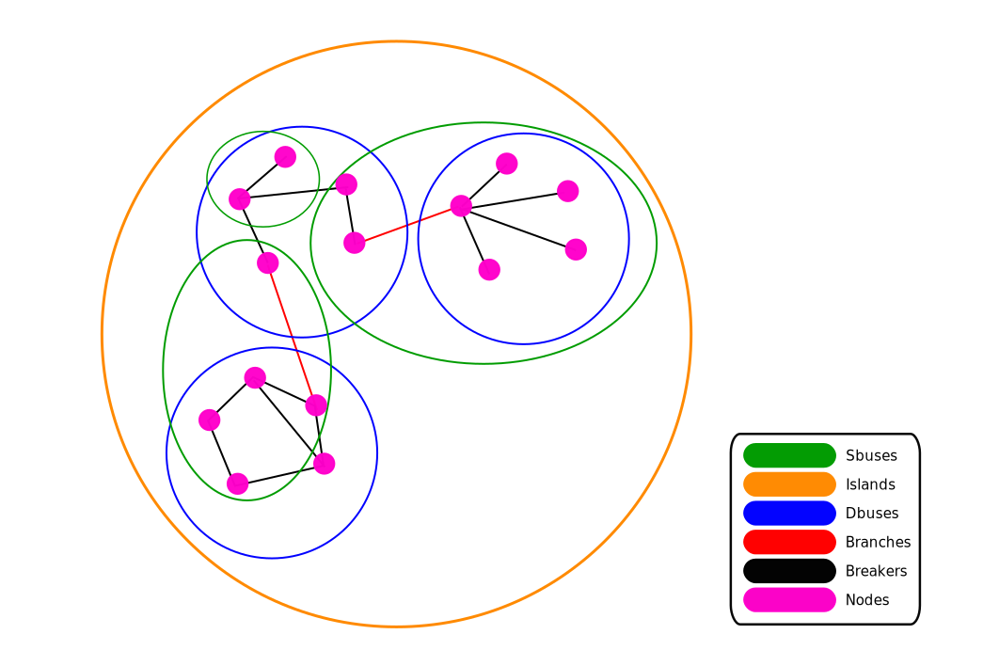

## Basic Definitions

* Breaker - Something connecting two nodes in an electrical network which can be opened or closed.

* Dbus (Dynamic Bus) - A group of nodes all connected by Breakers.

* Sbus (Static Bus) - Simply a connection of nodes.  An Sbus can be entirely arbitrary, it need not sit inside an Dbus, or contain a Dbus, though these things can happen.  Sbuses are an OSI construct, do not google.

* Branch - Something connecting two DBuses in an electrical network (can be thought of as an electrical line)

* Island - A collection of Dbuses all connected by Branches.

## Power Flow

Power Flow is run using the executable osi_pf.  

## Optimal Power Flow

## Contingency Analysis

* Contingency - the senario in which a specified set of equiptment (e.g. breakers, transformers, etc...) fail.

* Dynamic Contingency - A contingency which is dynamic...

* RAS (Remedial Action Scheme) - A set of programmiable instructions for devices in a network to follow in the event of a contingency.

Contingency analysis is the process of systematically applying contingencies to a network model and then running power flow to measure the stability of the system.

## State Estimator

## Breaker Flow

Breaker Flow is run using the application osi_brk_flow.  The process takes all branches and ignores them, it then takes each breaker and treats is as a branch.  All nodes which were connected via a breaker are then treated as Dbuses connected via branches.

## Topology

Topology is run using osi_pf -N.
